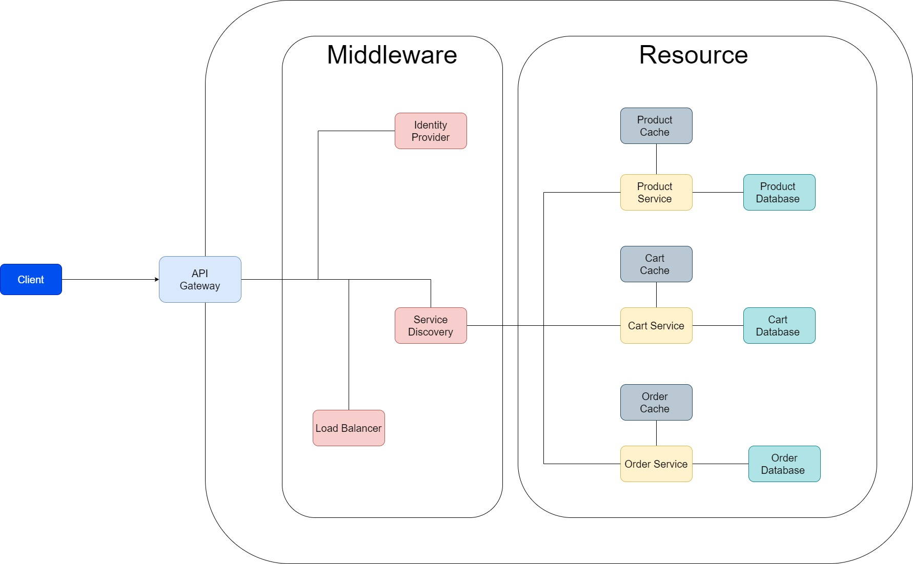

## Architecture of e-commerce system
### Architecture Overview
This project applies the **Microservice** Design Pattern

_Source [drawio](assests/drawio/e-commerce.drawio)_

Service Design Pattern
**API Gateway**
https://microservices.io/patterns/apigateway.html

**API Composition**
https://microservices.io/patterns/data/api-composition.html

Database Design Pattern
**Database per service**
* Private-tables-per-service – each service owns a set of tables that must only be accessed by that service
* Schema-per-service – each service has a database schema that’s private to that service

Messaging Design Pattern

API for e-commerce system
https://www.freecodecamp.org/news/a-guide-to-ecommerce-apis/
